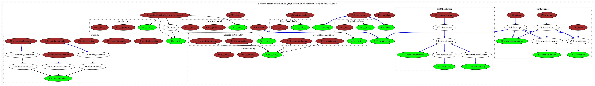
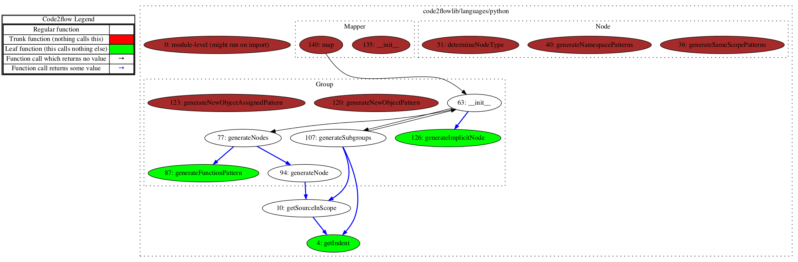

code2flow
=========

Turn your Python and Javascript source code into DOT flowcharts

Code2flow is an experimental script that will sweep through your project source code looking for function definitions. Then it will do another sweep looking for where those functions are called. Code2flow connects the dots and presents you with a flowchart estimating the functional structure of your program.

Code2flow is especially useful for untangling spaghetti code and getting new developers up to speed.

Code2flow is EXPERIMENTAL and meant to provide a **rough overview** of the structure of simple projects. Source code which is just a little esoteric will break this. Even with normal-people code, there are many known limitations (see below) as well as many outright bugs. **Expect MOST aspects of this application to change in future releases.**

Here is what happens when you run it on the python calendar module


When you run it on code2flow/languages/python.py


On jquery


Installation
------------

Download, navigate to the directory, and run:

```bash
sudo ./setup.py install
```

If you don't have it already, you will also have to install graphviz

Using apt-get:
```bash
sudo apt-get install graphviz
```

Using port (for macs):
```bash
sudo port install graphviz
```

Usage
-----

To generate a DOT file run something like:

```bash
code2flow mypythonfile.py
```

Or, for javascript

```bash
code2flow myjavascriptfile.js
```

By default, code2flow will render a DOT file, out.gv and a PNG file, out.png.

You can also render the flowchart in any of the formats that graphviz supports:
bmp canon cgimage cmap cmapx cmapx_np dot eps exr fig **gif** gv imap imap_np ismap jp2 jpe **jpeg** jpg pct pdf pic pict plain plain-ext **png** pov ps ps2 psd sgi **svg** svgz tga tif tiff tk vml vmlz x11 xdot xlib

For example:
```bash
code2flow mypythonfile.py -o myflow.jpeg
```

Specify multiple files and even use *
```bash
code2flow project/directory/*.py
```

Limitations
-----------

Code2flow is meant to provide a reasonable conjecture of the structure of simple projects and has many known limitations.

* Objects and functions in arrays are not handled correctly
* The logic for whether or not a function returns is simply looking for 'return' in that function
* Functions not declared in the initial class definitions (e.g. attached later) are not handled
* Dynamically generated and lambda functions are not handled
* Those functions inherited from a parent class are not handled
* In python, import ... as ... is not handled correctly
* In javascript, prototypes will result in unpredictable results
* And so so so many more

Feature / Language Requests
----------------

There is a lot in the pipeline already but those requests which keep coming up repeatedly will get priority.

To get the feature you want more quickly there are two options:

A. The project is open source so it is easy to contribute.

B. I am available for hire on contract and will happily build your request or just do headstands for you all day for the correct amount of money. For more about me, visit http://scottrogowski.com/about
