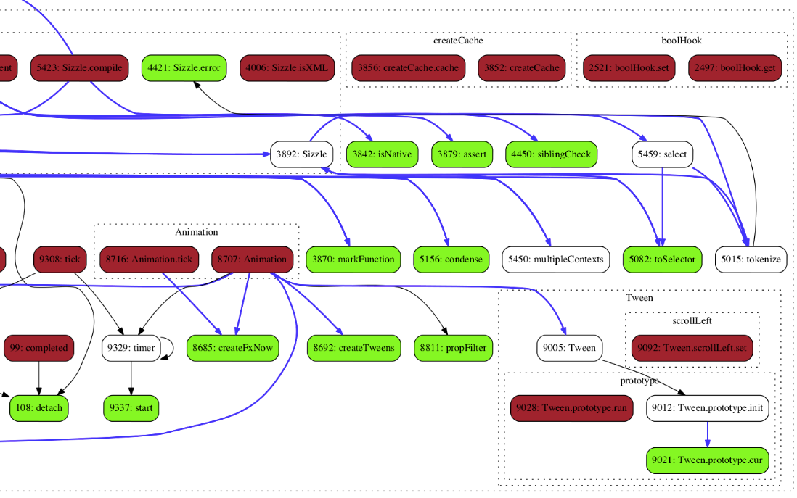
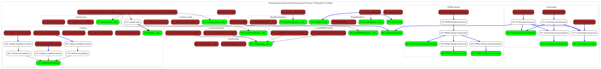
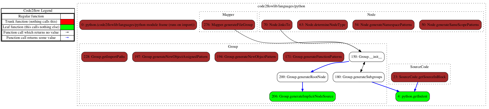

### Notes from 2017
- This is an older project which I am no longer working on. It was built before ES6 existed and before Python 3 had much usage. While it was always experimental and will probably still give you insights into your code, it will increasingly show signs of age. I am also unable to addess any issues, bugs, or pull requests.
- Like anyone who has been an engineer for more than 6 months, I am downright embarrassed by code I wrote when I was younger and this is no exception. Tabs!?!? What was I thinking????
- The domain, code2flow.com is unrelated to this project and as far as I can tell through the internet archive, they launched their service after this repository was created. I've never heard anything from them and it doesn't appear like they use anything from here

code2flow
=========

Turn your Python and Javascript source code into DOT flowcharts

Code2flow will sweep through your project source code looking for function definitions. Then it will do another sweep looking for where those functions are called. Code2flow connects the dots and presents you with a flowchart estimating the functional structure of your program.

In other words, code2flow generates callgraphs

Code2flow is especially useful for untangling spaghetti code and getting new developers up to speed.

Code2flow is EXPERIMENTAL and meant to provide a **rough overview** of the structure of simpler projects. There are many known limitations (see below). **Expect MOST aspects of this application to change in future releases.**

Here is what happens when you run it on jquery


On the python calendar module


On code2flow/languages/python.py


Installation
------------

[Download](https://github.com/scottrogowski/code2flow/archive/master.zip), navigate to the directory, and run:

```bash
sudo python setup.py install
```

If you don't have it already, you will also have to install graphviz

Using apt-get:
```bash
sudo apt-get install graphviz
```

Using port (for macs):
```bash
sudo port install graphviz
```

Usage
-----

To generate a DOT file run something like:

```bash
code2flow mypythonfile.py
```

Or, for javascript

```bash
code2flow myjavascriptfile.js
```

By default, code2flow will render a DOT file, out.gv and a PNG file, out.png.

You can also render the flowchart in any of the formats that graphviz supports:
bmp canon cgimage cmap cmapx cmapx_np dot eps exr fig **gif** gv imap imap_np ismap jp2 jpe **jpeg** jpg pct pdf pic pict plain plain-ext **png** pov ps ps2 psd sgi **svg** svgz tga tif tiff tk vml vmlz x11 xdot xlib

For example:
```bash
code2flow mypythonfile.py -o myflow.jpeg
```

Specify multiple files, import directories, and even use *
```bash
code2flow project/directory/*.js
```

```bash
code2flow project/directory --language js
```


Limitations
-----------

Code2flow is meant to provide a reasonable conjecture of the structure of simple projects and has many known limitations.

* Arrays of functions are not handled
* The logic for whether or not a function returns is simply looking for 'return' in that function
* Functions not declared in the initial class/object definitions (e.g. attached later) are mostly not handled
* Dynamically generated and lambda functions are mostly not handled
* In python, functions inherited from a parent class are not handled
* In python, import ... as ... is not handled correctly
* In javascript, prototypes will result in unpredictable results
* And many more

Basically, code2flow may not diagram your sourcecode exactly as you might expect it to


Feedback / Bugs / Contact
-----------------------------

Please do email!
scottmrogowski@gmail.com


How to contribute
-----------------------

1. You can contribute code! The project is open source and is new so any reasonably useful feature would probably be helpful and accepted. New languages are especially appreciated!

2. You can spread the word! A simple way to help is to share this project with others. If you have a blog, mention code2flow! Linking from relevant questions on StackOverflow or other programming forums also helps quite a bit. I would do it myself but it is unfortunately against the community guidelines. The more exposure this project gets, the more I can devote my time to building it!


Feature / Language Requests
----------------

There is a lot in the pipeline already but email me! Those requests which keep coming up repeatedly will get priority.

To get the feature you want more quickly there are two options:

A. The project is open source so it is easy to contribute.

B. I am available for hire on contract and will happily build your request or just do headstands for you all day for the correct amount of money. For more about me, visit http://scottrogowski.com/about
